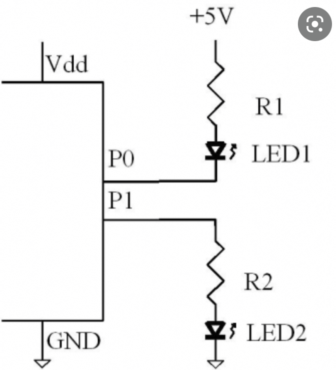
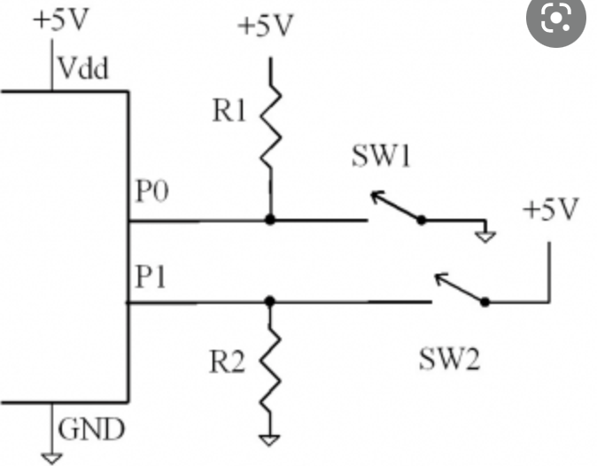

## Preparation tasks (done before the lab at home)

1. Draw two basic ways to connect a LED to the output pin of the microcontroller: LED active-low, LED active-high.



2. [Calculate LED resistor value](https://electronicsclub.info/leds.htm) for typical red and blue LEDs.


| **LED color** | **Supply voltage** | **LED current** | **LED voltage** | **Resistor value** |
| :-: | :-: | :-: | :-: | :-: |
| red | 5&nbsp;V | 20&nbsp;mA | 2V | 150 ohm |
| blue | 5&nbsp;V | 20&nbsp;mA | 4V | 50 ohm |

```LaTeX
R = \frac{V_{SUPPLY}-V_{LED}}{I} =
```

3. Draw the basic ways to connect a push button to the microcontroller input pin: button active-low, button active-high.



