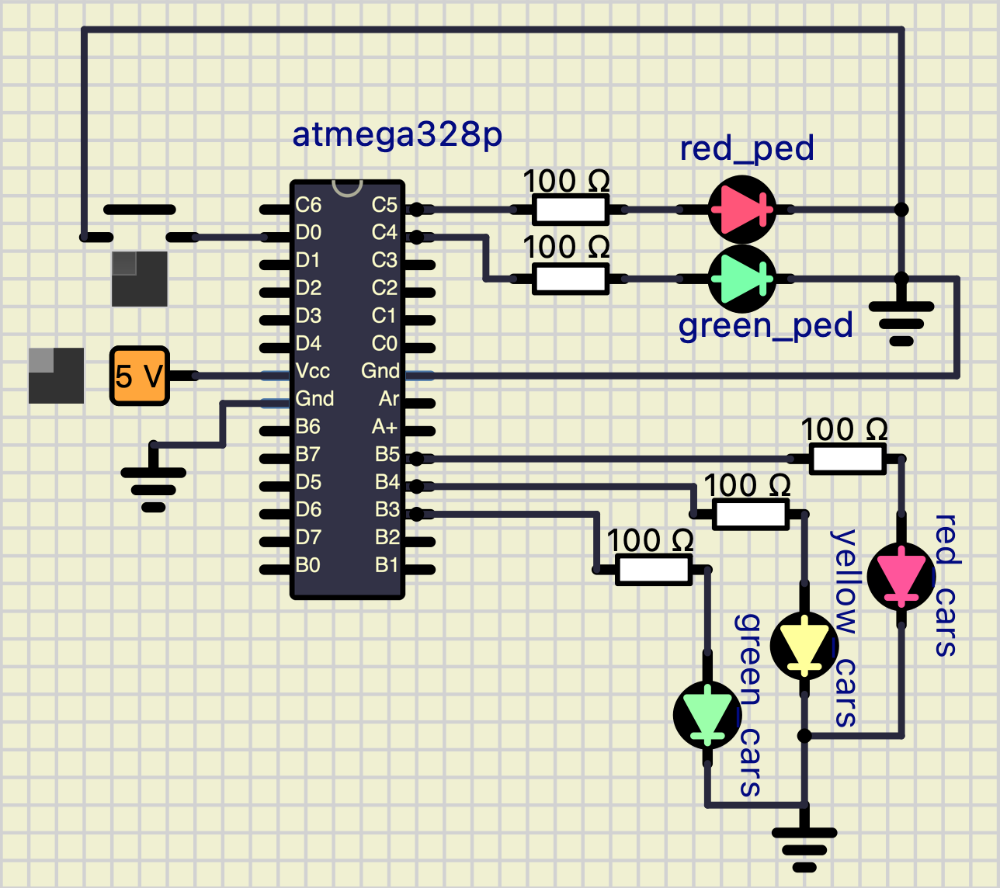

# Lab 3: Kryštof Buroň

Link to my `Digital-electronics-2` GitHub repository:

   [https://github.com/christ-0ff/Digital-Electronics-2](https://github.com/christ-0ff/Digital-Electronics-2)

### Data types in C

1. Complete table.

| **Data type** | **Number of bits** | **Range** | **Description** |
| :-: | :-: | :-: | :-- | 
| `uint8_t`  | 8 | 0, 1, ..., 255 | Unsigned 8-bit integer |
| `int8_t`   | 8 | -128 - 0 - 127 | Signed 8-bit integer |
| `uint16_t` | 16 | 0 - 65.535 | Unsigned 16-bit integer |
| `int16_t`  | 16 | -32.768 - 0 - 32.767 | Signed 16-bit integer |
| `float`    | 32 | -3.4e+38, ..., 3.4e+38 | Single-precision floating-point |
| `void`     | 0 | 0 | Void returns void "nothing" |


### GPIO library

1. Description of the difference between the declaration and the definition of the function in C:

   * Function declaration - Function declaration gives us information about function itself. It gives us return type of the function, name of the function, and parameters which are used by the function(if there are any/function does not need to contain any parameters).
   
   * Function definition - Function definition gives us same information about function as function declaration, but in addition it contains body of the function. Body of the function contains a collection of statements that tells us what the function does.

2. Part of the C code listing with syntax highlighting, which toggles LEDs only if push button is pressed. Otherwise, the value of the LEDs does not change. Use function from your GPIO library. Let the push button is connected to port D:

```c
/* Defines -----------------------------------------------------------*/
#define LED_GREEN   PB5     // AVR pin where green LED is connected
#define LED_RED     PC5  
#define BUTTON      PD0

/* Includes ----------------------------------------------------------*/
#include <util/delay.h>     // Functions for busy-wait delay loops
#include <avr/io.h>         // AVR device-specific IO definitions
#include <avr/sfr_defs.h>
#include "gpio.h"           // GPIO library for AVR-GCC

int main(void)
{
    // Green LED at port B
    GPIO_config_output(&DDRB, LED_GREEN);
    GPIO_write_low(&PORTB, LED_GREEN);

    // Configure the second LED at port C
    GPIO_config_output(&DDRC, LED_RED);
    GPIO_write_high(&PORTC, LED_RED);

    // Configure Push button at port D and enable internal pull-up resistor
    GPIO_config_input_pullup(&DDRD, BUTTON);

    // Infinite loop
    while (1)
    {
        
        if(bit_is_clear(PIND, BUTTON))
        {
            // Pause several milliseconds
            _delay_ms(BLINK_DELAY);
            
            GPIO_toggle(&PORTB, LED_GREEN);
            GPIO_toggle(&PORTC, LED_RED);
            loop_until_bit_is_set(PIND, BUTTON);
        }
    }

    // Will never reach this
    return 0;
}
```


### Traffic light

1. Scheme of traffic light application with one red/yellow/green light for cars and one red/green light for pedestrians. Connect AVR device, LEDs, resistors, one push button (for pedestrians), and supply voltage. The image can be drawn on a computer or by hand. Always name all components and their values!

   

