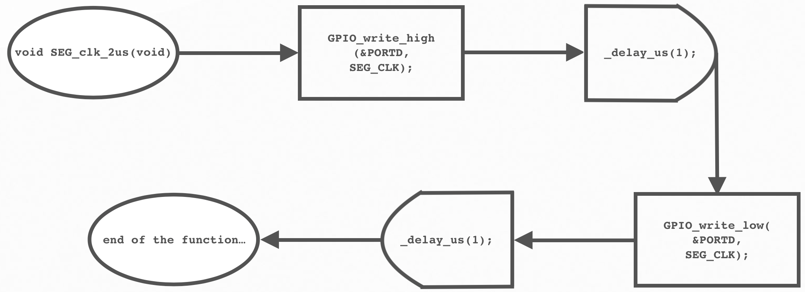
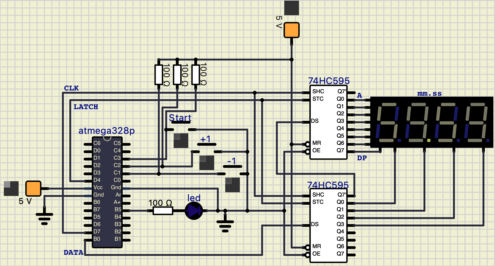

# Lab 5: Kryštof Buroň

Link to my `Digital-electronics-2` GitHub repository:

   [https://github.com/christ-0ff/Digital-Electronics-2](https://github.com/christ-0ff/Digital-Electronics-2)


### 7-segment library

1. Description of the difference between Common Cathode and Common Anode 7-segment display:
   * CC SSD - Common cathode means that all cathodes of 7-segment are connected to the ground. Thus by applying logic 1 to a particular pin of one segment will make it shine.
   * CA SSD - Common anode means that all anodes are connected to high level of voltage source. So by applying logic low to a pin of a segment makes the segment glow. 

2. Code listing with syntax highlighting of two interrupt service routines (`TIMER1_OVF_vect`, `TIMER0_OVF_vect`) from counter application with at least two digits, ie. values from 00 to 59:

```c
/**********************************************************************
 * Function: Timer/Counter1 overflow interrupt
 * Purpose:  Increment counter value from 00 to 59.
 **********************************************************************/
ISR(TIMER1_OVF_vect)
{
    if(citac <= 59)
    {
    citac++;    
    digit1 = citac / 10;
    digit0 = citac % 10;
    }
    
    else
    {
    citac = 0;
    }
}
```

```c
/**********************************************************************
 * Function: Timer/Counter0 overflow interrupt
 * Purpose:  Display tens and units of a counter at SSD.
 **********************************************************************/
ISR(TIMER0_OVF_vect)
{
    static uint8_t pos = 0;
        if (pos == 0)
        {
            SEG_update_shift_regs(digit1, 1);
            pos++;
        }
        else
        { 
            SEG_update_shift_regs(digit0, 0);
            pos = 0;      
        }
}
```

3. Flowchart figure for function `SEG_clk_2us()` which generates one clock period on `SEG_CLK` pin with a duration of 2&nbsp;us.
   


### Kitchen alarm

A kitchen alarm with a 7-segment display, one LED and three push buttons: start, +1 minute, -1 minute. The +1/-1 minute buttons are used to increment/decrement the timer value. After pressing the Start button, the countdown starts. The countdown value is shown on the display in the form of mm.ss (minutes.seconds). At the end of the countdown, the LED will start blinking.

1. Scheme of kitchen alarm:

   
