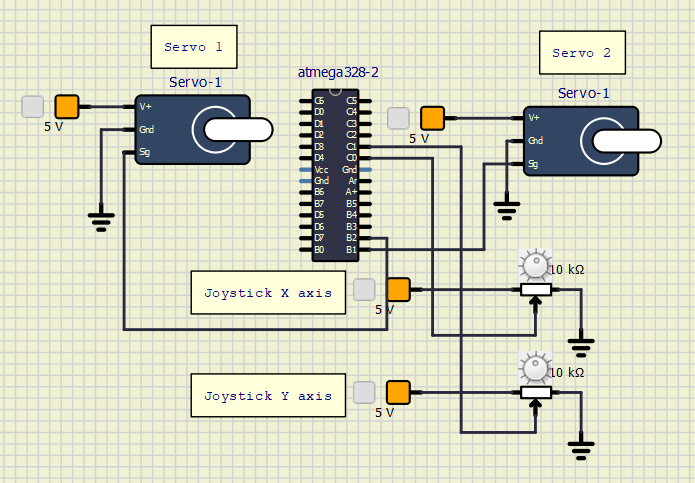

# Meteostanice

### Členové teamu

* Buroň Kryštof (Senzor BME280)
* Dočekal Ondřej (LCD display)
* Lukáč Vladimír (Fotorezistor & Servomotor & Joystick)

Odkaz na GitHub repozítář:

[https://github.com/christ-0ff/Digital-Electronics-2/tree/main/Labs/project](https://github.com/christ-0ff/Digital-Electronics-2/tree/main/Labs/project)

### Obsah

* [Cíle projektu](#cile)
* [Popis hardwaru](#hardware)
* [Popis knihoven](#libs)
* [Hlavní aplikace](#main)
* [Video](#video)
* [References](#references)

## Cíle projektu

Vytvoření meteostanice pro měření teploty a tlaku s natáčecím solárním panelem, a se zobrazováním hodnot na display.

## Popis hardwaru

* Měřící sensor BME 280, který měří teplotu a tlak.
* LCD display - Zobrazení výsledných hodnot
* Servomotor - Natáčení solárního panelu
* Joystick - Manuální řízení servomotorů
* Fotorezistor - Snímání intenzity světla

## Popis knihoven

### Vlastní knihovny
* GPIO - Knihovna s funkcemi pro kontrolu AVR pinů.
* Timer - Knihovna pro nastavení ISR časovačů.
* I2C(TWI) - Knihovna pro I2C(TWI) komunikaci mezi senzory.
* LCD - Základní knihovna pro ovládání LCD displaye.

### Systémové knihovny
* <avr/io.h> - Knihovna pro definování vstupních a výstupních pinů.
* <avr/interrupt.h> - C knihovna pro AVR-GCC definující přerušení.
* <stdlib.h> - C knihovna pro převod funkcí.
* <util/delay.h> - Knihovna pro "delay" definice.
* <avr/sfr_defs.h> - Knihovna k testování bitových hodnot v kontrolních registrech.

## Hlavní aplikace

### Ovládání servo motoru fotorezistorem

Servo je řízeno pomocí PWM. Je třeba si definovat periodu cyklů a jeho WGM (Waveform Generation Mode). Na následujícím obrázku je znázorněno ovládání serva pomocí PWM.

   

Jelikož 320,000.0 cyklů za 1 sekundu je pro ICR1 příliš mnoho, rozhodli jsme se to zkrátit na 1/16. Takže za dobu 20ms, což je doba Serva 9g (50Hz) se za 1 sekundu děje 30 PWM cyklů při zvoleném ICR1.
Servo se nastaví do neinvertujícího módu, takže bude počítat směrem z dolů nahoru. V invertujícím módu by za stejnou dobu například 2ms počítalo směrem shora dolů a duty cyckle serva by byl mnohem vyšší.

Chceme-li, aby servo se pohybovalo podle citlivosti fotorezistoru, je třeba nastavit fotorezistor.
Jako první je třeba vědět, jak funguje fotorezistor. Při nulovém osvětlení (absolutní tma) je odpor fotorezistoru největší (řádově MΩ), při normálním denním osvětlení se odpor fotorezistoru pohybuje ve stovkách kΩ a při největším osvětlení odpor fotorezistoru dosahuje hodnoty stovky až desítky Ω (teoreticky 0Ω)
Stanovíme hodnotu rezistoru pro dělič napětí R1 = 100kΩ

Přibližné stanovení hodnot je znázorněno na obrázku níže.

   

Abychom dokázali číst hodnotu napětí z fotorezistoru musí být dodrženy tyto kroky:

    * 1. Fotorezistor musí být připojen do série s rezistorem (dělič napětí)
    * 2. Je třeba zjistit hodnotu napětí na výstupu děliče napětí
    * 3. Z výstupního napětí přibližně určit hodnotu ADC

Když je hodnota napětí na výstupu děliče napětí rovna vstupnímu napětí 5V, tehdy je hodnota ADC maximální a opačně při vystupnímu napětí přibližně 0V je ADC hodnota také 0. Vypočtené hodnoty ADC pro různá výstupní napětí jsou znázorněny v tabulce níže.
Rp znázorňuje hodnotu odporu fotorezistoru, hodnota opdoru Rp při normálním osvětlení je Rp = 140kΩ.

#### Tabulka ADC hodnot pro vybraná výstupní napětí.

| **Rp** | **U2** | **ADC** |
| :-: | :-: | :-- | 
| <100Ω | 5V | 1023 |
| 10kΩ | 4.5V | 920 |
| 50kΩ | 3.3V | 682 |
| 100kΩ | 2.5V | 512 |
| 140Ω | 2.1V | 430 |
| 800kΩ | 0.5V | 102 |
| >1,21MΩ | 0 | 0 |

### Ovládání servo motoru pomocí joysticku

Princip ovládání servomotorů zůstává stejný, ale namísto jednoho proměnlivého rezistoru se budou tentokrát používat 2 proměnlivé rezistory (2 potenciometry).

   

Aby Arduino dokázalo s těmito analogovými hodnotami pracovat, je třeba provést A/D převod podobně jako u fotorezistoru.

#### Vývojový diagram serva s fotorezistorem a joystickem

   

## Video

Write your text here

## References

1. Write your text here.