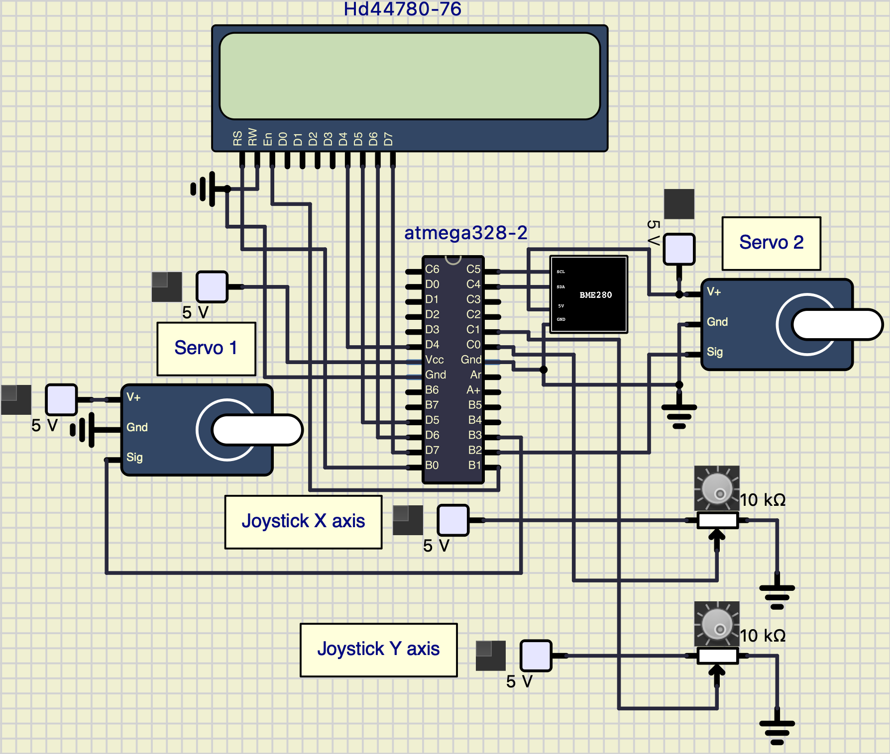
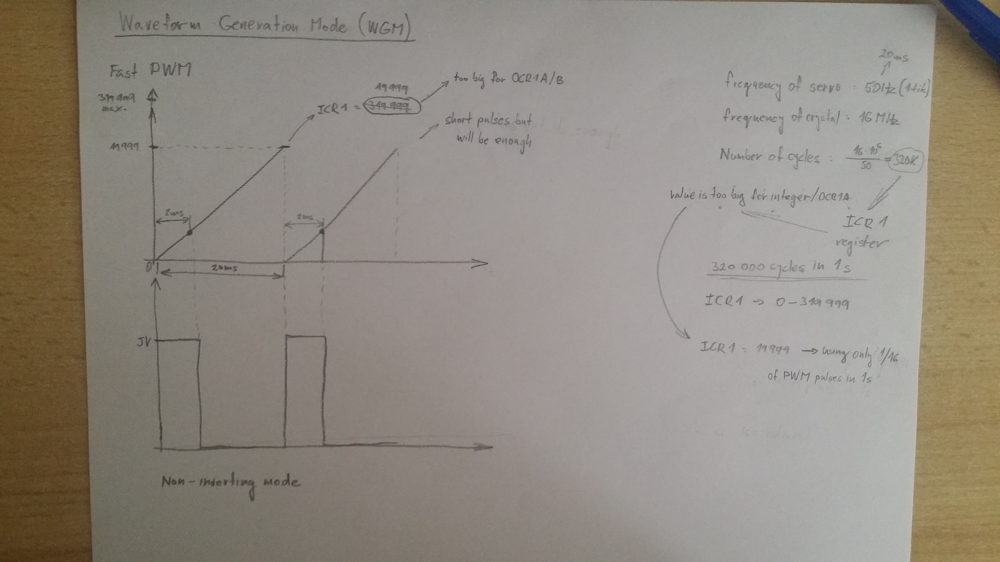
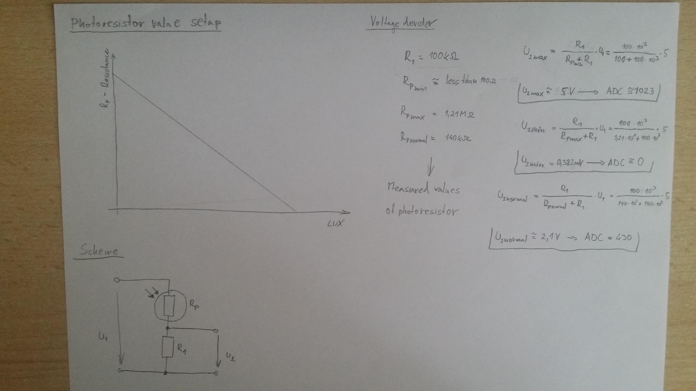
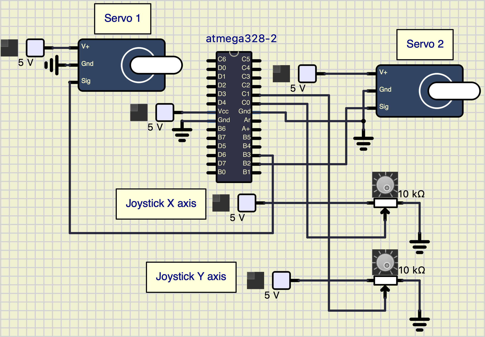
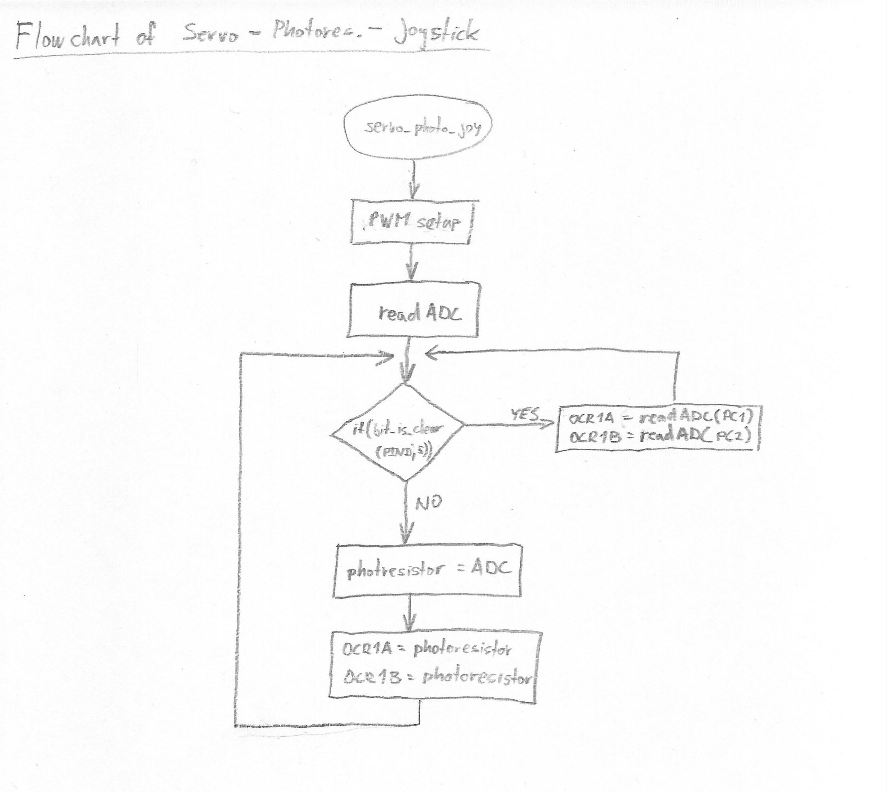
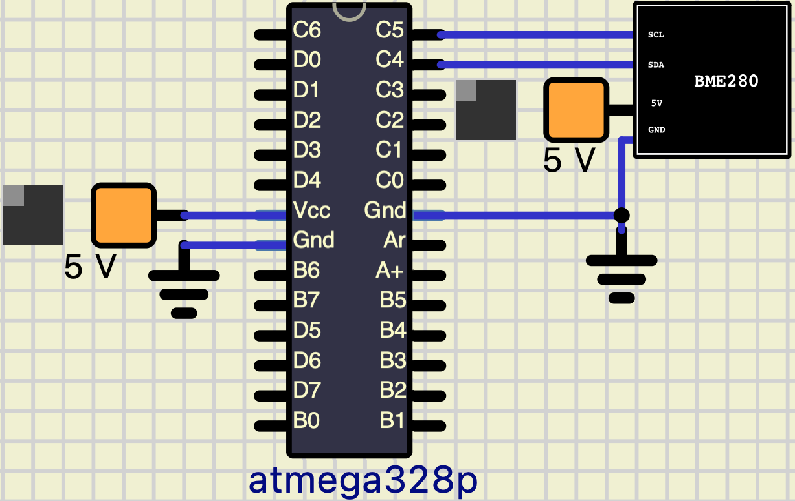
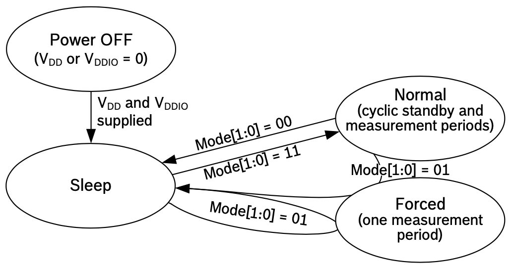
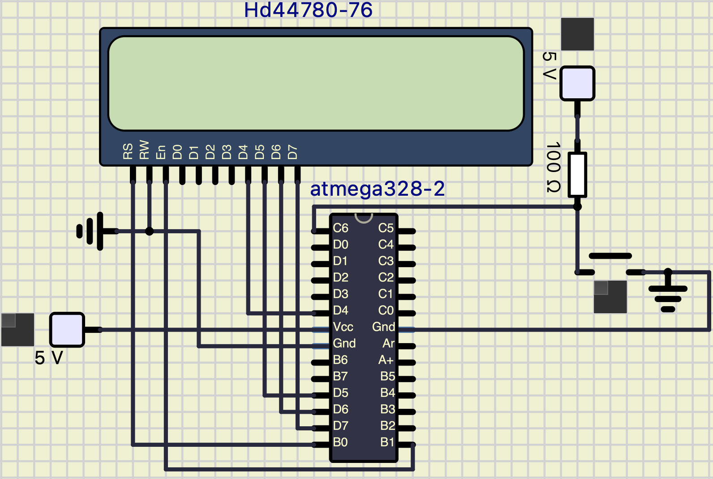
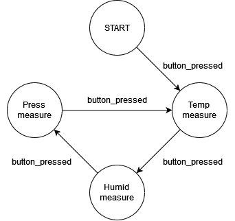

# Meteostanice

### Členové teamu

* Buroň Kryštof (Senzor BME280)
* Dočekal Ondřej (LCD display)
* Lukáč Vladimír (Fotorezistor & Servomotor & Joystick)

Odkaz na GitHub repozítář:

[https://github.com/christ-0ff/Digital-Electronics-2/tree/main/Labs/project](https://github.com/christ-0ff/Digital-Electronics-2/tree/main/Labs/project)

### Obsah

* [Cíle projektu](#cile)
* [Popis hardwaru](#hardware)
* [Popis knihoven](#libs)
* [Hlavní aplikace](#main)
* [Video](#video)
* [References](#references)

## Cíle projektu

Vytvoření meteostanice pro měření teploty a tlaku s natáčecím solárním panelem, a se zobrazováním hodnot na display.

## Popis hardwaru

* Měřící sensor BME 280, který měří teplotu a tlak.
* LCD display - Zobrazení výsledných hodnot.
* Servomotor - Natáčení solárního panelu.
* Joystick - Manuální řízení servomotorů.
* Fotorezistor - Snímání intenzity světla.

## Popis knihoven

### Vlastní knihovny
* GPIO - Knihovna s funkcemi pro kontrolu AVR pinů.
* Timer - Knihovna pro nastavení ISR časovačů.
* I2C(TWI) - Knihovna pro I2C(TWI) komunikaci mezi senzory.
* LCD - Základní knihovna pro ovládání LCD displaye.

### Systémové knihovny
* <avr/io.h> - Knihovna pro definování vstupních a výstupních pinů.
* <avr/interrupt.h> - C knihovna pro AVR-GCC definující přerušení.
* <stdlib.h> - C knihovna pro převod funkcí.
* <util/delay.h> - Knihovna pro "delay" definice.
* <avr/sfr_defs.h> - Knihovna k testování bitových hodnot v kontrolních registrech.

## Hlavní aplikace

   

### 1. Ovládání servo motoru
#### Ovládání servo motoru fotorezistorem

Servo je řízeno pomocí PWM. Je třeba si definovat periodu cyklů a jeho WGM (Waveform Generation Mode). Na následujícím obrázku je znázorněno ovládání serva pomocí PWM.

   

Jelikož 320,000.0 cyklů za 1 sekundu je pro ICR1 příliš mnoho, rozhodli jsme se to zkrátit na 1/16. Takže za dobu 20ms, což je doba Serva 9g (50Hz) se za 1 sekundu děje 30 PWM cyklů při zvoleném ICR1.
Servo se nastaví do neinvertujícího módu, takže bude počítat směrem z dolů nahoru. V invertujícím módu by za stejnou dobu například 2ms počítalo směrem shora dolů a duty cyckle serva by byl mnohem vyšší.

Chceme-li, aby servo se pohybovalo podle citlivosti fotorezistoru, je třeba nastavit fotorezistor.
Jako první je třeba vědět, jak funguje fotorezistor. Při nulovém osvětlení (absolutní tma) je odpor fotorezistoru největší (řádově MΩ), při normálním denním osvětlení se odpor fotorezistoru pohybuje ve stovkách kΩ a při největším osvětlení odpor fotorezistoru dosahuje hodnoty stovky až desítky Ω (teoreticky 0Ω)
Stanovíme hodnotu rezistoru pro dělič napětí R1 = 100kΩ

Přibližné stanovení hodnot je znázorněno na obrázku níže.

   

Abychom dokázali číst hodnotu napětí z fotorezistoru musí být dodrženy tyto kroky:

    * 1. Fotorezistor musí být připojen do série s rezistorem (dělič napětí)
    * 2. Je třeba zjistit hodnotu napětí na výstupu děliče napětí
    * 3. Z výstupního napětí přibližně určit hodnotu ADC

Když je hodnota napětí na výstupu děliče napětí rovna vstupnímu napětí 5V, tehdy je hodnota ADC maximální a opačně při vystupnímu napětí přibližně 0V je ADC hodnota také 0. Vypočtené hodnoty ADC pro různá výstupní napětí jsou znázorněny v tabulce níže.
Rp znázorňuje hodnotu odporu fotorezistoru, hodnota opdoru Rp při normálním osvětlení je Rp = 140kΩ.

##### Tabulka ADC hodnot pro vybraná výstupní napětí.

| **Rp** | **U2** | **ADC** |
| :-: | :-: | :-- | 
| <100Ω | 5V | 1023 |
| 10kΩ | 4.5V | 920 |
| 50kΩ | 3.3V | 682 |
| 100kΩ | 2.5V | 512 |
| 140Ω | 2.1V | 430 |
| 800kΩ | 0.5V | 102 |
| >1,21MΩ | 0 | 0 |

#### Ovládání servo motoru pomocí joysticku

Princip ovládání servomotorů zůstává stejný, ale namísto jednoho proměnlivého rezistoru se budou tentokrát používat 2 proměnlivé rezistory (2 potenciometry).

   

Aby Arduino dokázalo s těmito analogovými hodnotami pracovat, je třeba provést A/D převod podobně jako u fotorezistoru.

##### Vývojový diagram serva s fotorezistorem a joystickem

   

### 2. Čtení hodnot ze senzoru BME 280
Čtení hodnot ze senzoru BME 280 je uskutečněno pomocí I2C(TWI) komunikace. Pomocí I2C čteme hodnoty z paměťových registrů -- určených pro uložení naměřenýh dat -- daných datasheetem, které následně musíme přepočítat pomocí funkcí, a pomocí kompenzačních dat uložených v senzoru na správná data určující teplotu, tlak a vlhkost.

*Připojení senzoru BME 280 k Arduino UNO*

#### Čtení a kombinování kompenzačních hodnot
Čtení kompenzačních hodnot je uskutečněno pomocí I2C komunikace za pomocí `twi` knihovny od pana Tomáše Frýzy, Petera Fleuryho. Čtení dat je provedeno jednorázovým čtením všech hodnot. Vzhledem k tomu, že paměť kompenzačních dat je rozdělena na dvě části, tak i čtení dat musí proběhnout dvakrat i přes to, že všechna data čteme jednorázově.
První čtení je uskutečněno na paměťových adresách `0x88` až `0xA1`. Druhé čtení začíná na adrese `0xE1` a končí na adrese `0xE7`. 
Z toho důvodu, že všechna kompenzační data jsou uložena v 8 bitových slovech, a přepočítávací funkce většinu z těchto dat požadují v určitém datovém typu, tak musíme většinu přečtených 8 bitových slov spojit do jednotlivých 16 bitových určených datových typů. Ty poté můžeme použít k přepočtu dat ze senzoru na reálné hodnoty teploty, tlaku a vlhkosti. Následující tabulka ukazuje jak adresy registrů, kde jsou jednotlivá datová slova uložena, tak i výsledné spojení do daného datového typu.

*Tabulka kompenzačních parametru s názvem a datovým typem*
| **Adresa registru** | **Obsah registru** | **Datový typ** |
| :-: | :-: | :-- | 
| 0x88/0x89 | dig_T1 [7:0]/[15:8] | unsigned short |
| 0x8A/0x8B | dig_T2 [7:0]/[15:8] | signed short |
| 0x8C/0x8D | dig_T3 [7:0]/[15:8] | signed short |
| 0x8E/0x8F | dig_P1 [7:0]/[15:8] | unsigned short |
| 0x90/0x91 | dig_P2 [7:0]/[15:8] | signed short |
| 0x92/0x93 | dig_P3 [7:0]/[15:8] | signed short |
| 0x94/0x95 | dig_P4 [7:0]/[15:8] | signed short |
| 0x96/0x97 | dig_P5 [7:0]/[15:8] | signed short |
| 0x98/0x99 | dig_P6 [7:0]/[15:8] | signed short |
| 0x9A/0x9B | dig_P7 [7:0]/[15:8] | signed short |
| 0x9C/0x9D | dig_P8 [7:0]/[15:8] | signed short |
| 0x9E/0x9F | dig_P9 [7:0]/[15:8] | signed short |
| 0xA1 | dig_H1 [7:0] | unsigned char |
| Změna paměti |
| 0xE1/0xE2 | dig_H2 [7:0]/[15:8] | signed short |
| 0xE3 | dig_H3 [7:0] | unsigned char |
| 0xE4/0xE5[3:0] | dig_H4 [11:4]/[3:0] | signed short |
| 0xE5[7:4]/0xE6 | dig_T5 [3:0]/[11:4] | signed short |
| 0xE7 | dig_H6 | signed char |

#### Inicializace senzoru
K inicializaci je opět použita I2C komunikace pomocí knihovny `twi`. Senzor má několik nastavitelných módů, a to `Sleep mode`,`Forced mode` a `Normal mode`.

Funkce jednotlivých módů:
* `Sleep mode` - Tento mód je nastaven jako výchozí mód po zapnutí senzoru. V tomto módu jsou přístupny všechny registry, a proto ještě před inicializací senzoru čteme kompenzační data. V tomto módu senzor neprovádí žádná měření, a tak je jeho odběr energie na jeho minimu.
* `Forced mode` - Ve "vynuceném módu" je provedeno jedno měření podle jeho nastavení. Jakmile je měření dokončeno, tak se senzor vrátí do `Sleep mode`, a data z měření jsou dostupná v paměťových registrech. Jakmile chceme provést další měření, musíme znovu zvolit `Forced mode`.
* `Normal mode` - `Normal mode` je mód, kdy je prováděno opakované automatické meření. Senzor se v tomhle módu přepíná ze stavu `Sleep mode` do stavu `Normal mode`, kde senzor naměří hodnoty, a následně se přepně do stavu `Sleep mode`. Můžeme také nastavit jak často se budou jednotlivá měření opakovat. Jednotlivá nastavení se pohybují od 0,5 do 1000 ms.

*Obrázek stavového diagramu ukazuje přechod mezi jednotlivými módy*

Dále můžeme nastavit "oversampling" naměřených ADC dat, a také jejich filtraci IIR filtrem.
* Oversampling ADC dat slouží k redukci šumu, a k zpřesnění naměřených dat. Může nabývat hodnot `1×`, `2×`, `4×`, `8×` a `16×`. Jestliže je oversampling u některého z dat vypnutý, tak senzor tato data neměří.
* Filtr slouží k odfiltrování "skokových hodnot". Takové hodnoty mohou vzniknout například když na senzor zafouká vítr, tím se zvedne i změřený tlak, který už bude nepřesný, protože senzor nebude měřit tlak, ale nárazový vítr. Proto je dobré mít IIR filtr zapnutý. Filtr se dá zapnout jen pro teplotní a tlaková data. Zapnutím filtru se zvyšuje jejich rozlišení, ale také se zvyšuje odezva senzoru. Filtr může nabývat několika koeficientů, které zvyšují jeho přesnost, a to `1 - Vypnutý filtr`, `2`, `4`, `8` a `16`.

 I přes to, že sensor oplývá několika módy nastavení, tak je natvrdo nastavený do módu `Normal mode`, s nastaveným `16× oversamplingem` a s filtrem, jehož koeficient je nastavený na `16`.
 
#### Čtení paměťových registrů ukládající naměřená data a jejich kombinování
Čtení naměřených dat je uskutečněno pomocí `twi` knihovny. Podle datasheetu, je doporučenu jej udělat jednorázově. Je to kvůli toho, aby jsme náhodou nepomíchali data z jednotlivých měření, a taky abychom zredukovali provoz na I2C rozhraní. I kdybychom měli vypnutá nějaká měření, tak je stále lepší všechny registry přečíst jednorázově.
Jednotlivá data jsou uložena na adresách v paměti od adresy `0xF7` do adresy `0xFE`. Na následující tabulce můžeme vidět na jakých adresách jsou uložena která data.

*Tabulka naměřených dat*
| **Název registru** | **Adresa registru** | **Obash registru** |
| :-: | :-: | :-- | 
| hum_lsb | 0xFE | hum_lsb[7:0] |
| hum_msb | 0xFD | hum_msb[7:0] |
| temp_xlsb | 0xFC | temp_xlsb[7:4] |
| temp_lsb | 0xFB | temp_lsb[7:0] |
| temp_msb | 0xFA | temp_msb[7:0] |
| press_xlsb | 0xF9 | press_xlsb[7:4] |
| press_lsb | 0xF8 | press_lsb[7:0] |
| press_msb | 0xF7 | press_msb[7:0] |

Data vyčtená z tabulky musíme následně spojit do datasheetem určených datových typů. Pro vlhkost je to neznaménkový 16 bitový formát uložený v znaménkovém 32 bitovém formátu. Pro teplotu i tlak je to 20 bitový formát uložený ve znaménkovém 32 bitovém formátu. Takto spojená data můžeme následně přepočítat do správných změřených hodnot.

#### Přepočet dat
Přepočet dat je uskutečněn pomocí kompenzačních dat stažených z registrů senzoru a z naměřených dat. Všechna tato data jsou vložena do funkcí definovaných výrobcem, které jsou obsažené v datasheetě.

### 3. Ovládání LCD displaye
Pro vypisování potřebných dat na LCD display bylo využito knihovny "lcd.h", která umožňuje snadné nastavení pinů pro správnou funkci displaye. Pro inicializaci a zapnutí displaye se využije funkce "lcd_init()". Knihovna dále obsahuje důležitou funkci "lcd_puts()", která jako svůj parametr přijme řetězec znaků ve formě string a vypíše je na display. Pro nastavení polohy okud se mají znaky začít vypisovat slouží funkce "lcd_gotoxy()", která jako své parametry požduje x a y souřadnice na displayi.
Na následujícím obrázku lze vidět schéma připojení displaye na desku Arduino UNO.

### 4. Kostra aplikace
Hlavní součástí kódu aplikace je stavový automat, který mění stavy po zmáčknutí tlačítka a podle toho zobrazuje data.
Stavový automat s jednotlivými stavy vypadá následovně:

Automat funguje uvnitř ISR (interrupt service routine), která je vyvolána periodicky pomocí časovače (TIMER2), a to každých 128 us. Uvnitř této funkce se pkaždé zkontroluje, jestli bylo zmáčknuto tlačítko (popřípadě puštěno), a podle toho se vyvolá odpovídající událost - stavový automat se přesune do nového stavu. V každém z těchto stavů požádá program o data ze senzoru, a ty následně vypíše na LCD display. K této funkci byla použita knihovna "timer.h", vytvořena v jednom z našich cvičení v předmětu DE2.

## Video

Write your text here

## References

* [BME 280 - Datasheet](https://www.bosch-sensortec.com/media/boschsensortec/downloads/datasheets/bst-bme280-ds002.pdf) -- https://www.bosch-sensortec.com/media/boschsensortec/downloads/datasheets/bst-bme280-ds002.pdf
* [Video k servomotoru](https://www.youtube.com/watch?v=9WeewNNGs5E) -- https://www.youtube.com/watch?v=9WeewNNGs5E
* Veškerá cvičení z předmětu DE2
